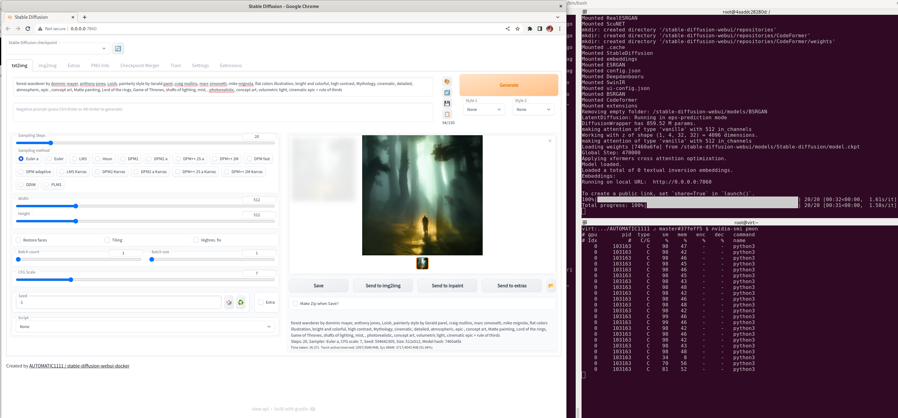

# stable-diffusion

Stable diffusion built using podman based on `quay.io/fedora/fedora:38`



There are older instructions based on [fedora:36](./README-fc36.md) if you need them.

## Prerequisites

- a working nvidia GPU with cuda (the stable diffusion model uses torch with cuda python libs)

I have a new dell-xps-15 9530, and my setup looks like this:

```bash
$ lspci | grep -Ei 'nvidia|VGA'
0000:00:02.0 VGA compatible controller: Intel Corporation Raptor Lake-P [Iris Xe Graphics] (rev 04)
0000:01:00.0 3D controller: NVIDIA Corporation AD106M [GeForce RTX 4070 Max-Q / Mobile] (rev a1)
```

I have Wayland with NVIDIA GPU for video using dkms at boot. I use the f37 repo for the proprietary cuda/nvidia drivers, but run fc38. It normally takes several months for NVIDIA to come up to speed for new releases.

```bash
# this gets me the latest nvidia driver
dnf config-manager --add-repo https://developer.download.nvidia.com/compute/cuda/repos/fedora37/x86_64/cuda-fedora37.repo
dnf -y module install nvidia-driver:latest-dkms
dnf -y install cuda
```

You can check everything works before you start, try this locally

```bash
python3.11 -c "import torch; print(torch.cuda.is_available())"
```

- podman with oci-hook configured properly for [nvidia](https://docs.nvidia.com/datacenter/cloud-native/container-toolkit/latest/install-guide.html)

Nothing too fancy here:

```bash
podman run --rm -it --security-opt=label=disable docker.io/nvidia/cuda:12.1.0-base-ubi8 nvidia-smi


Fri Jun 30 06:51:37 2023
+---------------------------------------------------------------------------------------+
| NVIDIA-SMI 535.54.03              Driver Version: 535.54.03    CUDA Version: 12.2     |
|-----------------------------------------+----------------------+----------------------+
| GPU  Name                 Persistence-M | Bus-Id        Disp.A | Volatile Uncorr. ECC |
| Fan  Temp   Perf          Pwr:Usage/Cap |         Memory-Usage | GPU-Util  Compute M. |
|                                         |                      |               MIG M. |
|=========================================+======================+======================|
|   0  NVIDIA GeForce RTX 4070 ...    On  | 00000000:01:00.0 Off |                  N/A |
| N/A   46C    P3              N/A /  35W |      5MiB /  8188MiB |      0%      Default |
|                                         |                      |                  N/A |
+-----------------------------------------+----------------------+----------------------+
                                                                                         
+---------------------------------------------------------------------------------------+
| Processes:                                                                            |
|  GPU   GI   CI        PID   Type   Process name                            GPU Memory |
|        ID   ID                                                             Usage      |
|=======================================================================================|
+---------------------------------------------------------------------------------------+
```

## Build the OCI Image

Download the data. This will take a while and approx (12GB) disk 😲

```bash
dnf -q install aria2
./download.sh
```

Build the container  using podman

```bash
make podman-build
```

Run it

```bash
make podman-run
```

## Demo It

Browse to `http://0.0.0.0:7860/` and type in some text. In this example i was using:

```text
forest wanderer by dominic mayer, anthony jones, Loish, painterly style by Gerald parel, craig mullins, marc simonetti, mike mignola, flat colors illustration, bright and colorful, high contrast, Mythology, cinematic, detailed, atmospheric, epic , concept art, Matte painting, Lord of the rings, Game of Thrones, shafts of lighting, mist, , photorealistic, concept art, volumetric light, cinematic epic + rule of thirds
```


## Attribution

Forked with 💕 from here. Check it out if you want to build other UI's.

https://github.com/AbdBarho/stable-diffusion-webui-docker